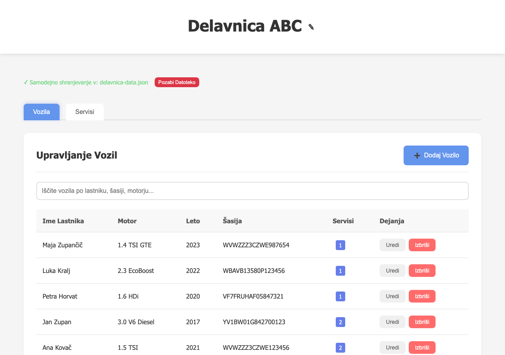
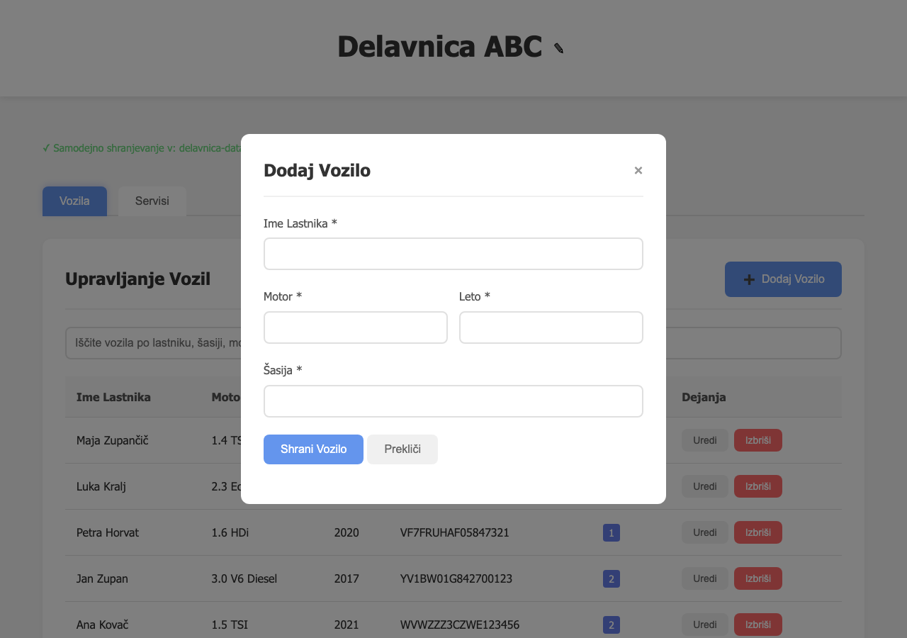

# Delavnica 🚗🔧

Odprtokodna aplikacija za vodenje servisne knjige, pripravljena za brezplačno uporabo v slovenskih servisih.

> **Brez spletnih storitev. Brez plačil. Brez omrežja — podatki ostanejo na tvojem računalniku.**

## Kaj je Delavnica?

Delavnica je preprosta, a zmogljiva aplikacija za mehanike in servisne delavnice v Sloveniji, ki omogoča:

- **Vodenje vozil** — registracija lastnikov, šasij, motorjev in letnikov vseh vozil v servisu
- **Servisna zgodovina** — beleženje vseh servisov z kilometražo, datumom in opombami za vsako vozilo
- **Iskanje in filtriranje** — hitro najdi vsako vozilo ali servis po imenu lastnika, motorju, šasiji ali opombah
- **Samodejno shranjevananje** — podatki se samodejno shranijo v JSON datoteko na tvojem računalniku
- **Popolnoma brezplačno** — brez naročnin, brez skritih stroškov, brez omejitev

## Funkcije

- ✅ Dodajanje, urejanje in brisanje vozil (lastnik, motor, leto, šasija)
- ✅ Vodenje servisne zgodovine za vsako vozilo
- ✅ Iskanje po vseh vozilih in servisih
- ✅ Samodejno shranjevanje v lokalno datoteko (Chrome/Edge)
- ✅ Prikaz števila servisov na vozilo
- ✅ Časovno urejena servisna zgodovina
- ✅ Preprost in pregleden vmesnik v slovenščini

## Zahteve

- **Brskalnik:** Google Chrome ali Microsoft Edge (različica 86 ali novejša)
- **Operativni sistem:** Mac, Windows ali Linux
- **Datotečni sistem:** Aplikacija uporablja File System Access API za samodejno shranjevananje podatkov v lokalno datoteko

> ⚠️ Firefox, Safari in drugi brskalniki trenutno niso podprti zaradi pomanjkanja dostopa do datotečnega sistema.

## Hitri začetek

1. Odprite `index.html` v Google Chrome ali Microsoft Edge
2. Kliknite **Izberi lokacijo za shranjevananje** in izberite mesto za shranjevananje podatkov
3. Vnesite ime vaše delavnice
4. Začnite dodajati vozila in servise!

## Slike aplikacije

### Pregled vozil
<!-- Slika 1: Pregled seznama vozil z iskanjem in stolpci (lastnik, motor, leto, šasija, servis) -->


### Servisna zgodovina
<!-- Slika 2: Pregled servisov z datumom, kilometražo in opombami -->


### Dodajanje vozila
<!-- Slika 3: Modalno okno za vnos novih podatkov o vozilu -->


## Tehnološki pogled

Delavnica je zgrajena kot čistodnevna spletna aplikacija brez odvisnosti:

- **HTML5 + CSS3** — responsive vmesnik, animacije, tabe
- **Vanilla JavaScript (ES6+)** — brez okvirov, brez odvisnosti
- **File System Access API** — samodejno shranjevanje podatkov
- **IndexedDB** — trajno shranjevanje povezave na datoteko
- **Brez backend-a** — vse deluje lokalno v brskalniku

## Razvoj

Za lokalni razvoj preprosto odprite `index.html` v brskalniku. Aplikacija ne potrebuje nobenega strežnika ali namestitvenega postopka.

```
delavnica/
├── index.html          # Glavna HTML struktura
├── styles.css          # Vsi stil in oblikovanje
├── app.js              # Glavna aplikacijska logika
├── constants.js        # Konstante in besedila
├── data-handler.js     # Ravnanje s podatki in shranjevanje
├── modal-manager.js    # Upravljanje modalnih oken
├── table-manager.js    # Upravljanje tabel
├── error-handler.js    # Obdelava napak
└── utils.js            # Pomožne funkcije
```

## Licenca

MIT License — brezplačna uporaba za vsakogar.

## Podpora

Če imate vprašanja, predloge ali želite prispevati, ustvarite novo vprašanje ali pull request.

---

**Izdelano za slovenske servisne delavnice.** 🇸🇮
